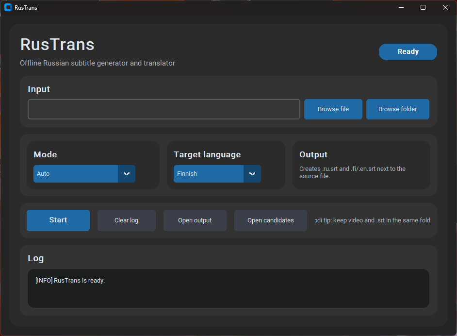

# RusTrans

Offline subtitle generator and translator (Russian → Finnish / English)

---

## Overview

RusTrans is a desktop application for generating and translating subtitles from locally stored video and audio content.

The tool is designed for working with personal recordings, educational materials, and private media libraries, enabling users to better understand spoken Russian through automatically generated subtitles.

The entire pipeline runs fully offline and does not rely on external APIs or cloud services.

---

## Key Features

- Automatic speech-to-text transcription (Russian)
- Translation into Finnish and English
- Subtitle generation in SRT format
- Processing of individual files or multiple files in a folder
- Clean and readable subtitle formatting
- Fully local execution

---

## Screenshot

---

## Usage

The application provides a simple workflow:

1. Select an input source:
   - video file (e.g. recorded speech, learning material)
   - subtitle file (Russian SRT)
   - folder with multiple media files

2. Choose processing mode:
   - Auto (detect type automatically)
   - Video → subtitles
   - Russian SRT → translated subtitles

3. Select target language:
   - Finnish
   - English

4. Start processing

The application generates subtitle files in the same directory as the input.

---

## System Integration

RusTrans is designed to work within a local media environment.

Generated subtitles can be used with:

- Kodi media center
- Raspberry Pi devices
- local network storage

This allows seamless playback of content with subtitles on external displays (e.g. TV) without requiring internet access.

---

## Technical Details

- Speech recognition: faster-whisper
- Translation: Argos Translate (offline)
- Audio processing: ffmpeg
- Subtitle handling: srt
- GUI: CustomTkinter
- Packaging: PyInstaller

---

## Design Principles

- Offline-first architecture
- Privacy-focused (no data sent externally)
- Simple and accessible interface
- Practical real-world usage

---

## Input Flexibility

The application supports multiple workflows:

- Video → Russian subtitles → translated subtitles
- Existing Russian subtitles → translation
- Batch processing for multiple files

---

## Notes

- No external APIs are used
- No user data is collected or stored
- Designed for local, private usage scenarios

---

## Author

Developed as a personal project focused on combining speech recognition, translation, and desktop UI development.
