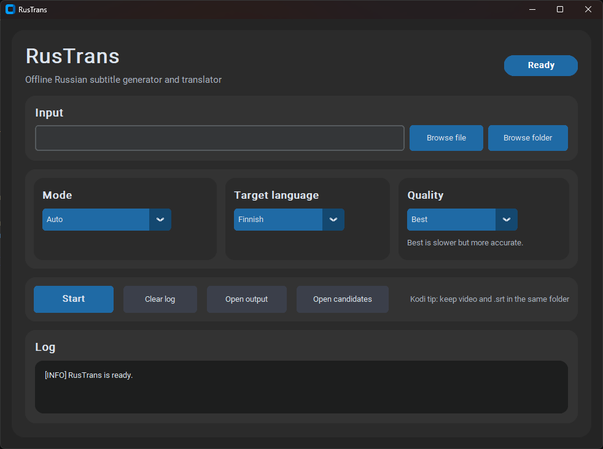

# RusTrans

Offline subtitle generator and translator for Russian speech.

RusTrans is a desktop application that generates subtitles from Russian audio/video content and translates them into Finnish or English. The project was built as a practical language-learning and accessibility tool for locally stored personal and educational media.

The application runs locally and does not use paid cloud APIs.

---

## Features

- Russian speech recognition from video files
- Translation into Finnish and English
- SRT subtitle generation
- Support for existing Russian `.srt` files
- Batch processing for folders with multiple media files
- Quality presets:
  - Fast
  - Balanced
  - Best
- Local idiom and glossary layer
- Suspicious translation candidate detection
- Desktop GUI built with CustomTkinter
- Local media workflow compatible with Kodi and Raspberry Pi setups

---

## Screenshot



---

## Use Case

RusTrans is designed for private, local language-learning workflows.

Example scenarios:

- generating subtitles for personal recordings
- working with Russian learning materials
- translating locally stored educational videos
- using generated subtitles with a local Kodi media setup on Raspberry Pi

The project does not include or distribute copyrighted media content.

---

## How It Works

The application supports three main workflows:

### Video input

```text
video file
→ audio extraction
→ Russian speech recognition
→ Russian SRT
→ translated Finnish / English SRT

### Subtitle input 

Russian SRT
→ translation
→ Finnish / English SRT

### Folder input

folder with multiple media files
→ batch subtitle generation

### Quality Modes

Fast

Uses a smaller speech recognition model for faster processing.

Balanced

Uses a medium model with balanced accuracy and speed.

Best

Uses stricter recognition settings for better subtitle quality. This mode is slower but recommended when accuracy is more important than speed.

### Translation Improvements

RusTrans includes additional text-processing layers to improve subtitle quality:

glossary for names and terms
idiom dictionary for known Russian expressions
post-processing for translated subtitles
suspicious phrase detection for future manual improvements

This helps reduce overly literal translations and makes the system easier to improve over time.


### Local AI Review

The project can be extended with a local AI reviewer using Ollama. This allows translation refinement without using external cloud APIs.

Kodi / Raspberry Pi Workflow

Generated .srt files can be used with Kodi by placing the subtitle file next to the media file.

This makes the application suitable for a local home media setup using:

Kodi
Raspberry Pi
local network storage
Tech Stack
Python
CustomTkinter
faster-whisper
Argos Translate
ffmpeg
srt
Ollama support
PyInstaller

### Installation

pip install -r requirements.txt
Make sure ffmpeg is installed and available in PATH.

### Run

python gui.py


